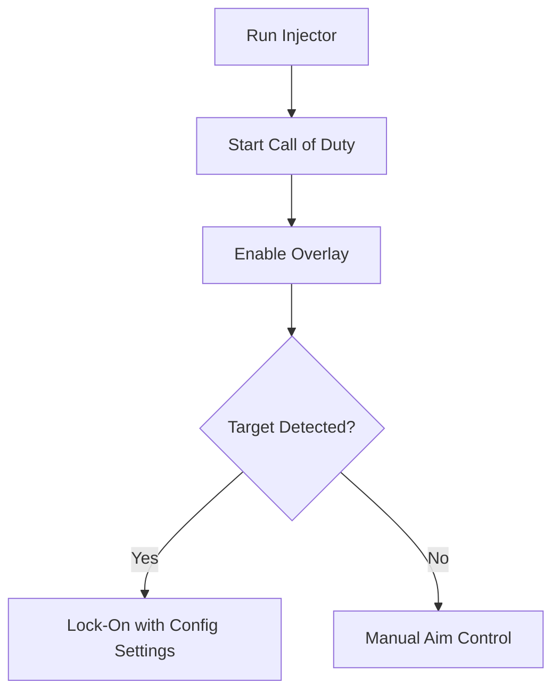

# Call of Duty Aimbot 🎯

The **Call of Duty Aimbot Software** is designed for players who want to practice precision shooting, refine reaction times, and test targeting mechanics with complete customization. With adjustable configs, smooth aim curves, and a clean overlay, you can set up the perfect training environment.

---

## 📝 Overview

Call of Duty is a game of milliseconds—missing a shot can cost the match. The aimbot provides **custom lock-on targeting, recoil balancing, and configurable FOVs**, giving you sharper tracking while letting you maintain natural gameplay flow.

\[!WARNING]
This tool is intended for **training and testing purposes**. Use responsibly and avoid online competitive environments.

[](#)
[](#)
[](#)
[](#)


---

## ⭐ Features

* **Customizable FOV** – Define lock-on radius for natural or tight aim assist.
* **Smooth Tracking** – Adjustable aim speed for fluid motion instead of snap.
* **Recoil Control** – Compensate vertical and horizontal weapon kick.
* **Bone Targeting** – Choose head, chest, or custom zones.
* **Hotkey Toggles** – Activate or deactivate instantly during play.
* **Config Profiles** – Save different setups for snipers, SMGs, or ARs.

---

## 🖥 Compatibility

| Platform          | Supported | Notes                    |
| ----------------- | --------- | ------------------------ |
| Windows 10/11     | ✅         | Fully supported          |
| Steam             | ✅         | Stable overlay           |
| Battle.net        | ✅         | Works with PC client     |
| Console (Xbox/PS) | ❌         | Not supported            |
| Linux (Proton)    | ⚠️        | Requires manual tweaking |

\[!NOTE]
Accessibility: Overlay includes customizable colors and FOV circles for visual clarity.

---

## ⚡ Setup Guide

1. **Download** the aimbot package.
2. Extract into your Call of Duty directory.
3. Run `Injector.exe` as administrator.
4. Launch the game, press `INSERT` to enable overlay.
5. Fine-tune configs in the in-game menu or `config.ini`.

```ini
[aimbot]
fov=90
smooth=5
recoil_control=true
bone=chest
hotkey=VK_RBUTTON
```

---

## 🔄 Aimbot Workflow



---

## ❓ FAQ

**Q: How is this different from aim assist?**
A: Aim assist subtly guides aim, while this aimbot provides full customizable lock-on.

**Q: Can I change target zones?**
A: Yes, bone targeting lets you pick head, chest, or custom points.

**Q: Does it work offline?**
A: Yes, it functions fully in offline or training modes.

**Q: Will it affect FPS?**
A: Very minimal performance impact.

**Q: Are configs saved automatically?**
A: Yes, all changes persist in your `config.ini` file.

---

## 🚀 Final Thoughts

The **Call of Duty Aimbot Software** offers **precision targeting, recoil control, and full customization** for a smoother, more controlled shooting experience. Perfect for training and practicing advanced mechanics.

---
